# Inktober 2019

I've never participated in hashtag inktober before - it's a huge undertaking where an artist will complete an illustration every day in october and post it on social media. Of course saying it's a huge undertaking is just an excuse not to participate because you could always just doodle something in 15 seconds and submit it (but let's be honest our egos prevent us from sharing underdeveloped art).

Regardless, even though I now have six month old twins, I decided to give it a shot this year - with a huge caveat: I won't be making illustrations, but physically taking notes with pen and paper on gamedev ideas. I used to take these kind of notes a lot, especially before I started doing game dev. For the past several years I've sort of adopted a "why take notes when I can just start making a game?"

I still stand by that for the most part - I get so much more value by just _doing_ gamedev than writing about it. But with a full time job, and two screaming babies at home, the amount of time I have to develop my own games is extremely limited. This means that a lot of ideas fizzle out almost immediately after they pop in my head.

I thought that by writing down these ideas, not only do I codify them in a way that will allow me to come back to work on them when I _do_ have time, but I also get a little mental exercise by working out these ideas in a medium that I hardly ever use anymore - pen and paper!

Here we are on November 1, and I have to say - even though I failed stupendously by only completing 12 out of 31 inktobers - I was totally right! It was nice to just take 5 minutes every now and then to sit with an idea and write some notes. It didn't negatively affect my day job or my duties as a parent, and in some cases it helped the creation of some of the ideas because I had already "created" them in my mind to some extent - it almost felt like I was remixing an old idea when taking the idea to code rather than poking around in the dark. Maybe I should take more notes, write more design documents, and spend more time outside of the computer? Nah.

Anyway, I thought I'd spend this blog post talking about some of these ideas and how they evolved from brain to paper to code.

# inktober 1 - Sinmap

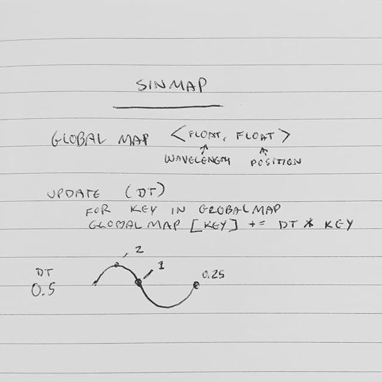

## Ideation

I had an idea that I'd like to be able to flash sprites at synced intervals, so for instance if I add some smoke particles to the screen and flash them, I don't want them to flash at unsynced intervals because that might break the illusion that they're all part of a cohesive cloud of smoke.

To do this I imagined keeping a map of different wavelengths and updating them all at once. That way you could just reference `Sinmap.map[1]` to get a sine wave that oscillates once per second and have it be synced across all instances that reference it.

## Creation

The pseudocode in the doodle above didn't work at all, but after some tinkering I ended up with this:

```haxe
using Math;

/**
 * A Synced getter for sin/cos
 * 
 * **Usage**
 * 
 * - Update counter: `SyncedSin.update(delta_time)`
 * - Get synced sin/cos values: `SyncedSin.synced_sin(10);` <- returns a synced sin value that takes 10 seconds to loop
 */
class SyncedSin
{

	static var counter = 0.0;
	public static function update(dt:Float) counter = (counter + dt) % 1;
	public static function synced_sin(wavelength:Float) return (counter * Math.PI * 2 / wavelength).sin();
	public static function synced_cos(wavelength:Float) return (counter * Math.PI * 2 / wavelength).cos();

}
```

It's a lot less complicated (no map needed, only updates one variable) and it abstracts out the idea of "individual wavelengths" by calculating it on the fly. I've added it to my haxe gamedev library [zerolib](https://github.com/01010111/zerolib). Haven't had a chance to use it in any games yet though!

# inktober 2 - Endless Rubber

## Ideation

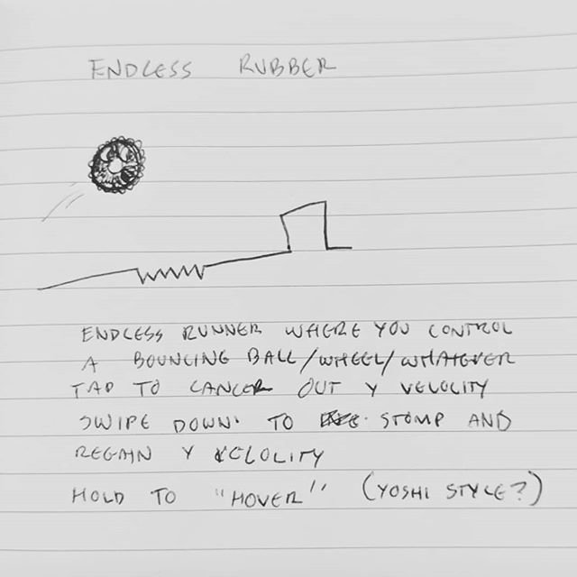

I had been working on an endless runner game at work in which you could tap to jump, and tap again to immediately dash back down (you can play an early build [here](http://01010111.com/eeeeendless-runner/)). At some point I mistyped "Endless Runner" as **"Endless Rubber"**.

At first I thought it was funny, but I had been experimenting with swiping and other gestures to jump and fall in meaningful ways, and I thought it might be interesting to try to make the experience of a wheel rather than a running guy.

## Creation

I spent a lunch break making a quick prototype - it does feel pretty interesting! You can play a very rough demo [here](http://01010111.com/endless-rubber/export/html5/bin/).

# inktober 3 - Tetris Dungeon Crawler

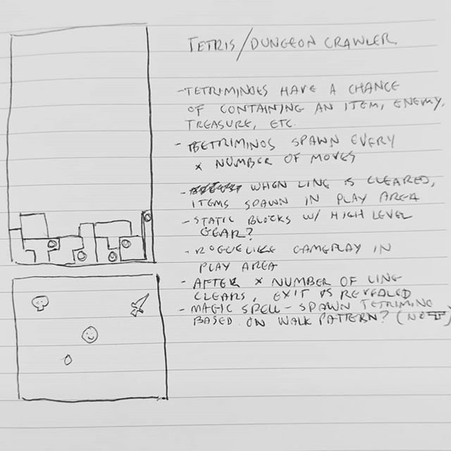

## Ideation

I was very intrigued by [this tweet](https://twitter.com/SquareAnon/status/1169006963868524551) but felt like although the concept was very very straight forward it may not be fun to play (this isn't an indictment of that dev, it's just a problem that they have to solve - and may have solved already!). I wanted to think of another way to mix the two genres in a meaningful way.

It was fun doodling this idea out - the basic idea is that there is a tetris board up top, and a dungeon room below it. Individual squares in a tetrimino may include an item, an enemy, or treasure. When you clear a line in the tetris section, it takes any item, enemy, or treasure from cleared squares and places them in the dungeon room. There's some interesting tension between having to clear tetriminos (after X number of line clears you may exit the dungeon) and having to deal with enemies in the dungeon.

I'll probably never make this, but it was a fun exercise in creating mechanics from a basic concept!

# inktober 4 - Slide Puzzle Platformer

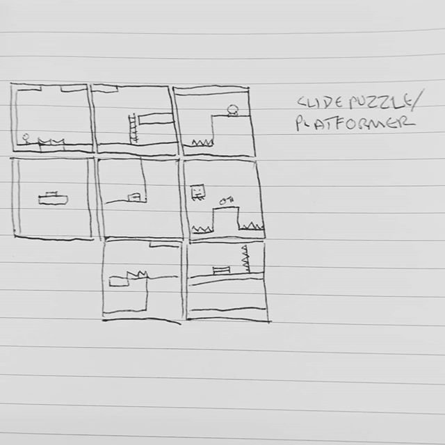

## Ideation

A long time ago I tried making a lemmings-like where you would draw cards and manipulate a level using powers given by the cards. It was fun to make but I went too hard in the paint and developed an ulcer. That was really bleak so the [game never got finished](https://01010111.tumblr.com/post/143859375059/this-represents-serious-progress-i-swear). I've also always loved slide puzzles. I was using a tool I made a while ago to generate game mechanic ideas called [Cardlink](http://01010111.com/Cardlink/) and a couple of cards spurred my interest. I don't remember exactly what they were, but it was most definitely something like **Slide** and **Walk**. I probably would have thought of some kind of Megaman slide mechanic had I not made the lemmings card game, but instead my brain went to [platformer where you slide pieces of the levels around like a slide puzzle to complete it].

It'd be really fun to make this, but instead I'll settle for playing [this](https://ldjam.com/events/ludum-dare/45/world-collector) awesome Ludum Dare winning Haxeflixel game made by [Joe Williamson](https://twitter.com/JoeCreates) with a slightly similar premise!

# inktober 5 - Dhulfiqar DX

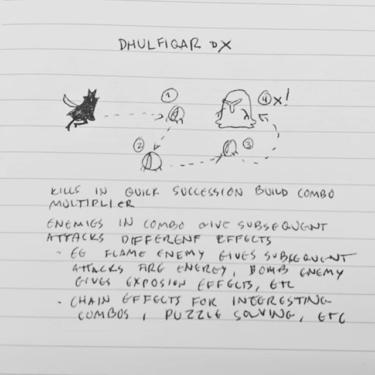

## Ideation

Way back in 2013 I made a game called Dhulfiqar for GBJam2. I don't think it's still online, but you can check out [Game Curator's awesome write up](https://game-curator.com/jams/gbjam-2-dhulfiqar/) on it. I've always wanted to come back to Dhulfiqar and [have attempted to](https://01010111.tumblr.com/post/89577131144/quickmode) at least once or twice. At one point my buddy [Sam Loeschen](https://twitter.com/polygone_) proposed a remix of the game centered around explosions and combos. I'm sure that idea had some bearing in coming up with this.

Maybe one day I'll come back to Dhulfiqar! I like this idea, but I feel like the game would be a pretty large undertaking, so unless some more fun ideas pop up you probably won't be playing Dhulfiqar DX anytime soon!

# inktober 6-7 - Dumb Ludum Dare ideas

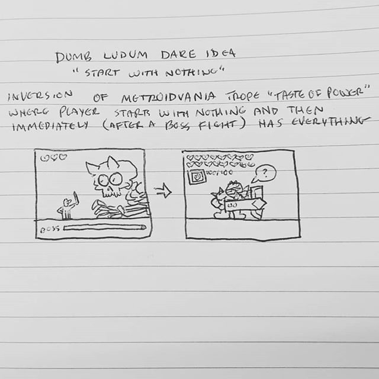
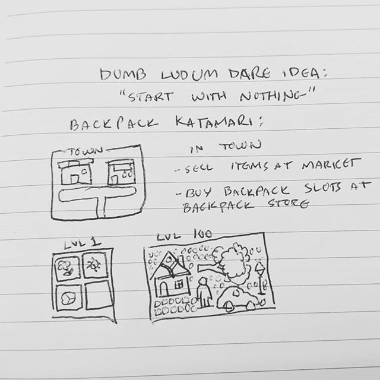

## Ideation

There's not a lot to be said about these except that I was jealous being stuck at home with my wonderful family while the rest of the world was jamming away at their ludum dare games. I took advantage of the fact that I was just writing down ideas to ideate on some games that would be **way** out of scope for a weekend long jam.

# inktober 8 - Cowboy Cards

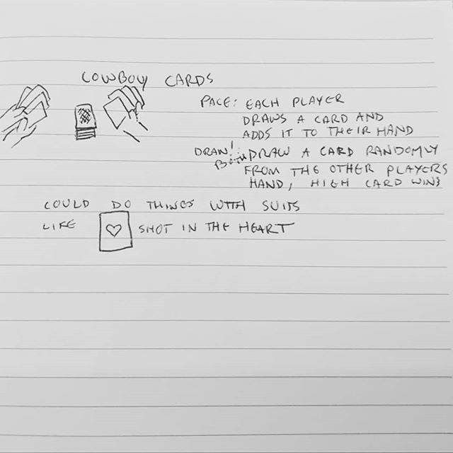

## Ideation

This idea is kind of fuzzy because I think it came to me in the middle of the night and I wasn't able to write it down until the morning. I really like the idea of taking a concept like a gun duel and mapping the actions of that very codified concept to game mechanics. I hardly ever come up with game ideas this way so it was pretty exciting.

Also I guess there's no coding required when making card game rules so go ahead and play it if you want! I haven't tested it out yet so this game might be totally broken (like, who wins here? The person that draws the highest card or the person who had the highest drawn card in their hand??).

# inktober 9 - WYSIWYG Autotiling

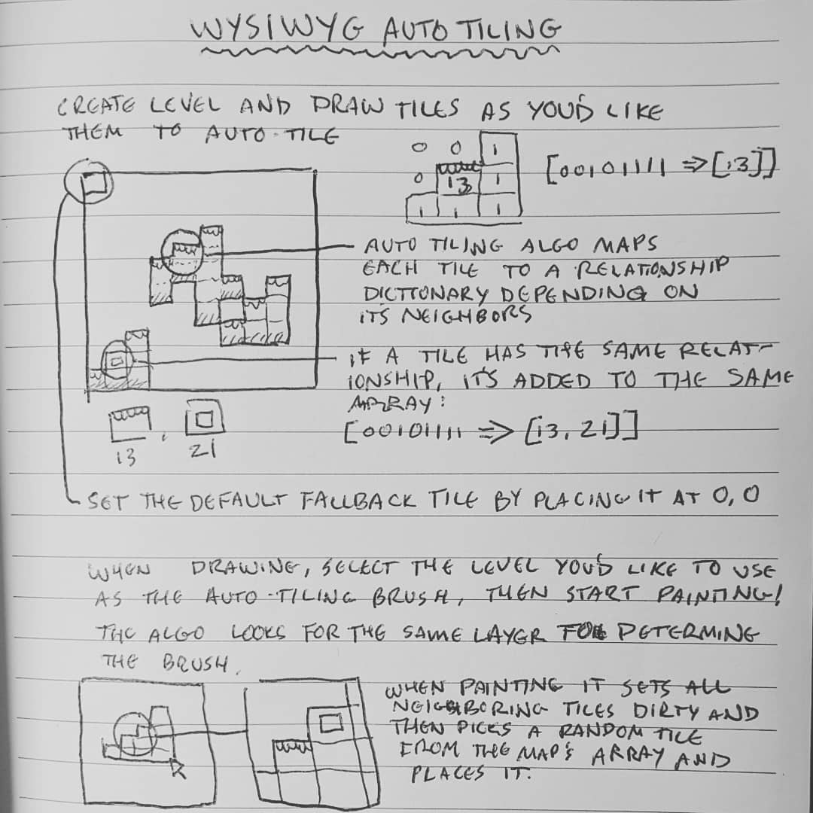

## Ideation

I've been working on a tilemap editor for several months now (I'll share as soon as it's available!) and one of the features that has been requested the most is auto tiling. Auto tiling is where you set up rules for which tiles to use when drawing out levels. Other map editors do this with various levels of success, but it's always felt like a tedious process to me. I'd much rather just skip the rules and paint tiles.

Regardless, I feel like it's a fun challenge to come up with a way of autotiling that fits multiple workflows (something current editors are not amazing at) and is intuitive to use for new users (another thing current editors are not amazing at). It occurred to me that the part I dislike the most is the shift in paradigm when drawing out levels and setting up these complex rule sets - so it might be best to just make the rule editor be the same exact tool as your level editor. It'd be relatively easy to take level data and extract the rules from there!

So far I haven't incorporated this into the map editor I'm working on, but I think I'll be adding it after the initial release!

# inktober 10 - Corporate Espionage Game

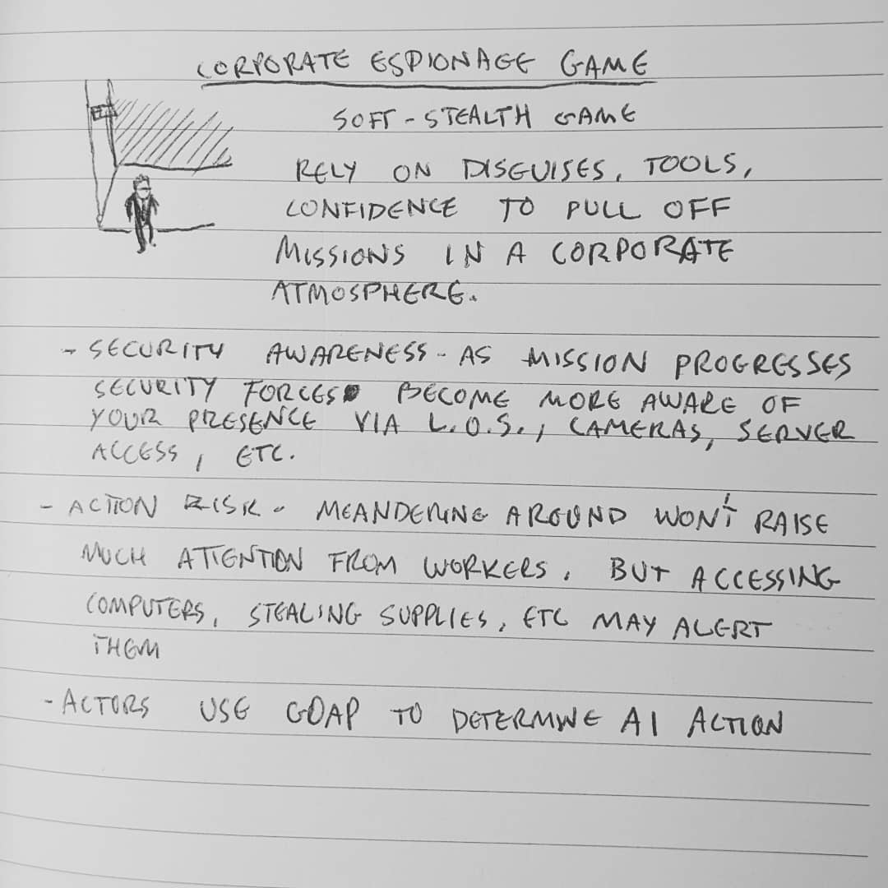

## Ideation

My nightly routine includes sitting for an hour or two trying to feed one of my twins - he's a very slow eater, especially at night. While the little guy is resting between sips of his bottle, I started playing games on my raspberry pi. It's a cool setup (maybe I'll blog about it someday) where I can lean back in bed with my guy in my lap and play games from various systems on the TV. I've been playing Metal Gear Solid: Ghost Babel (originally for Gameboy Color) a bit, and it got me thinking about how I've always wanted to make a similar 2D stealth game (I've actually made a few, [my latest](https://01010111.itch.io/escapehatch) was for ludum dare and it's not that amazing).

This also riffs on several other games that I've either started on or just dreamt of, the idea of making big skyscrapers to explore is something I've been really interested in for a while! I'd love to make this game at some point but the scope is kind of gigantic.

# inktober 11 - Office Worker GOAP Tasks

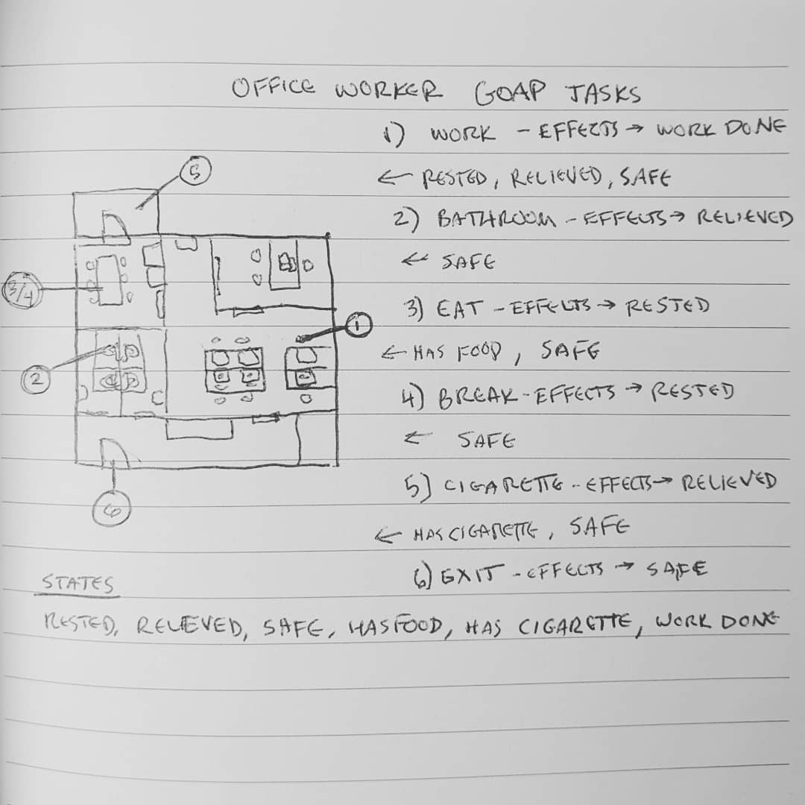

## Ideation

Fresh off the heels of corporate espionage - I thought one of the most fun things to do would be working on AI for the various agents in the game: guards, security systems, police, and - most interesting to me - office workers. I've played around with Goal Oriented Action Planning in the past but I thought it'd be fun to write some code to be reusable for future projects.

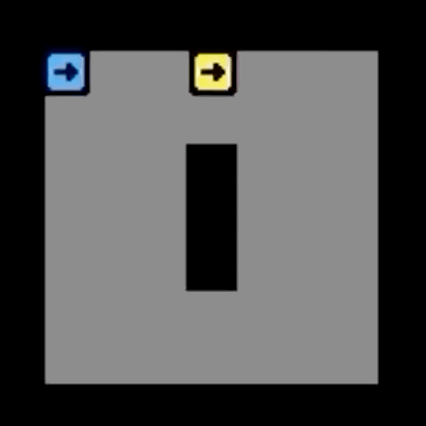

The first thing I did was create a very basic framework for actors. They have line of sight and make their own pathing - line of sight was fun to implement because for the first time I used the cross product of two vectors instead of trying to compare the angle between two points - way cooler!

Then I made a small framework for creating GOAP jobs and figuring out the best next step for an actor to accomplish a goal. I [added it to zerolib](https://github.com/01010111/zerolib/blob/dev/zero/utilities/GOAP.hx)!

# inktober 12 - Redshift Blueshift DX

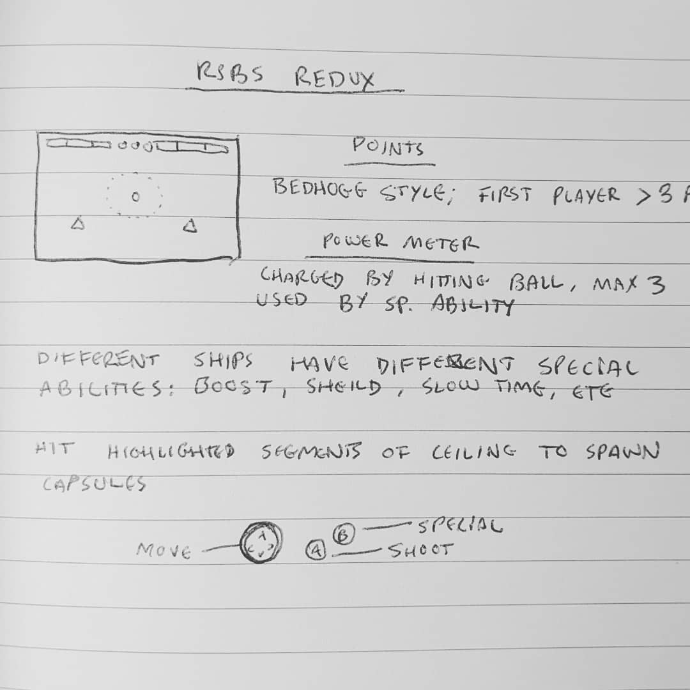

## Ideation

Redshift Blueshift was a paddle game I made with [Alan McCosh](https://twitter.com/whilesoftware) in 2015. It's pretty fun to play but I'm constantly thinking of ways to improve it! I remember back when we were developing it Alan pitched the idea of using tennis-like scoring instead of what we had (first to 3, 5, or 10). After looking up how tennis was scored I was so confused that I shot the idea down, but I after some time I think Alan was totally right! Tennis has an interesting tug of war element to the scoring that would totally benefit the game. I also feel like there's a lot of possibility space in using special abilities - right now the only special abilities are speeding up and slowing down the ships.

I'd love to team up with Alan again and make a sequel to RSBS - I've learned a ton since we made it, and working with Alan was a blast!

# Wrap up

I regret only doing a dozen of these, but it was fun! I'd like to continue to jot down notes in my notebook when an idea pops into my head, I do think that the act of writing on paper is fundamentally different from the act of typing words in an editor.

This has been a really long blog post, I think I may have spent more time writing it than I did on all of these inktober doodles combined 😩

Have a good November!