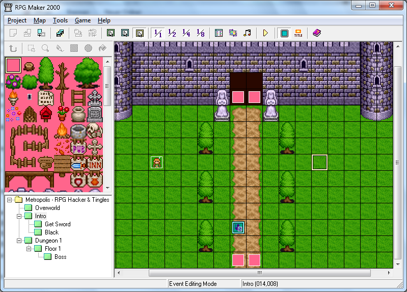
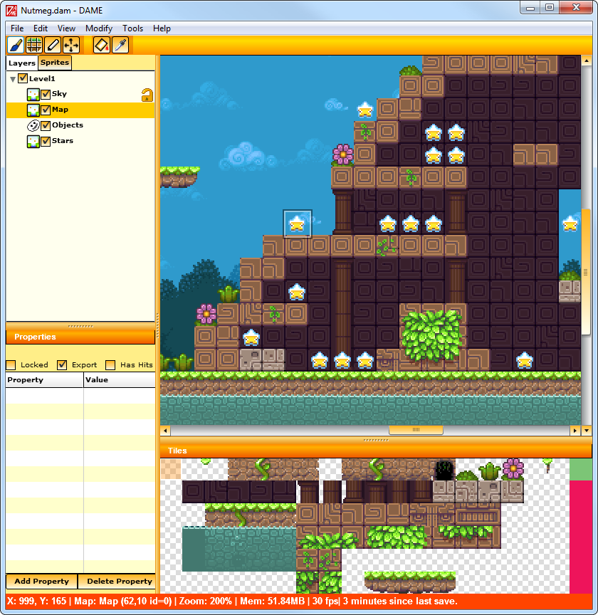
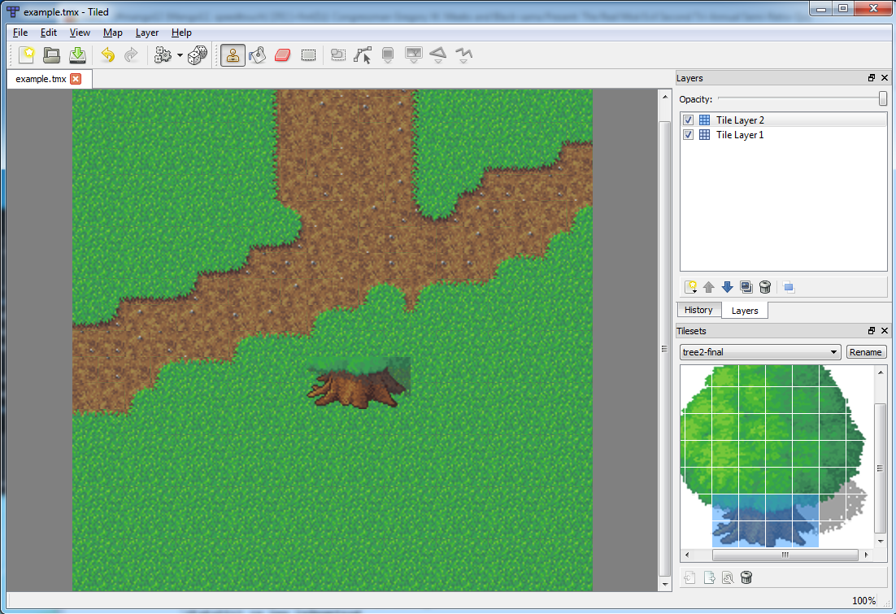
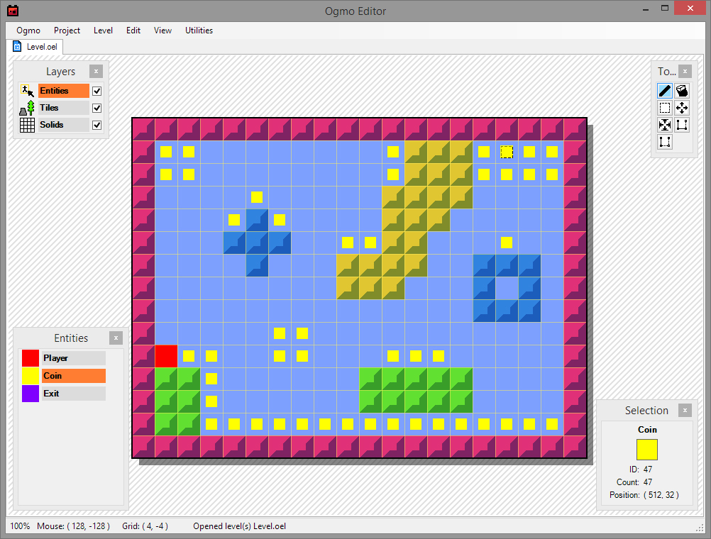
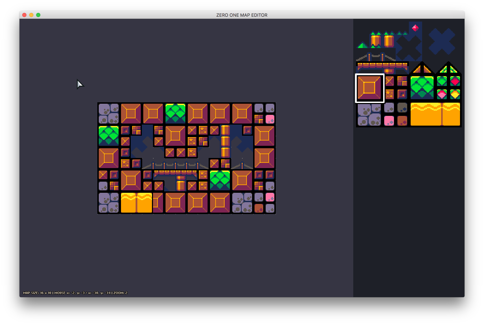
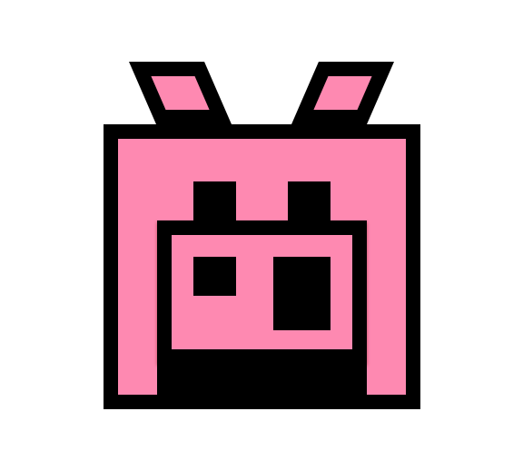
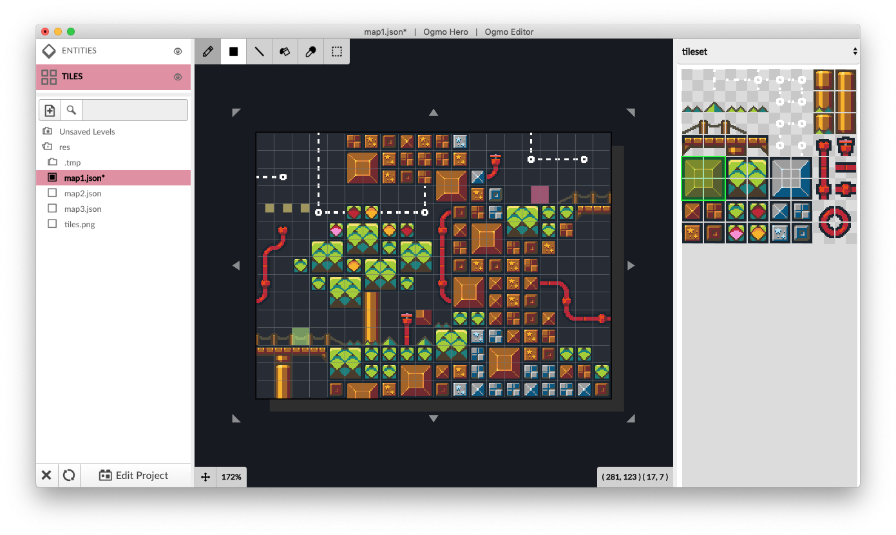

# The Story of OGMO Editor and me

On Friday the 15th of November, 2019, OGMO Editor 3 was released. The editor was a result of work of about a dozen developers and designers, beginning with Matt Thorson and Noel Berry - who needed a map editor for the development of Celeste - and ending with Caleb Cornett, Austin East, and myself. Caleb coordinated with Matt and Noel in early 2019 to finish the development of OGMO Editor 3. It's my assumption that Matt and Noel were busy with Celeste Chapter 9, setting up their new studio EXOK, and tons of other things, and just didn't have the time or energy to throw at finishing work on OGMO Editor 3 or supporting it after launch - and Caleb had maintained a Community Edition of OGMO Editor 2, which added some features, and fixed a few bugs that had plagued OGMO Editor 2 users for years.

## Level Editors are far and few between

When I was about three years old I played Super Mario Bros. and since then (over three decades now) I've had an urge to make video games. My very first attempt came shortly after playing Mario - I grabbed a marker and some paper, I drew some mountains, some monsters, and some coins, and I labeled the drawing "MOUNTAIN LEVEL". I stuck to level design on paper for the next decade or so, unaware of traditional pen and paper RPGs, tabletop board game design, and traditional cartography, I would make "levels" for my friends to play that consisted largely of facsimiles of mechanics and language you'd typically find in video games. I remember typically starting off with a small maze, and then adding power-ups, baddies, collectable treasures, and tons of spike traps. Players were expected to complete the levels by tracing their way through the maze, and shouting out actions that usually mapped to the same verbs you'd perform in a NES game - "BOP THE MONSTER", "JUMP THE PIT", etc.

In high school, my friends and I poked around in cracked copies of RPG Maker 95 and 2000. My friend Alan Young was a power-user, pushing RPG Maker past traditional RPG game play and making complete games. I was fascinated by RPG Maker because it was the first time I had the ability to take a tileset and create a world from it. This was the first time that urge to create games had been sated - and although the games I was the most interested in making would be almost impossible to develop in RPG Maker, the thrill of game development was still there, in large part because of this interaction of using tilesets to create worlds.

It would be another decade or so before I got around to making video games again. This time I was using an Adobe Flash framework called Flixel, which empowered me to create games similar to the NES games that got me hooked on the idea of game making in the first place. Back then, one of the few map editors around was a tool called DAME. DAME was a wonderful map editor that had all the features I needed, and it integrated with Flixel extremely well. I'd probably still be using DAME today if it weren't for OGMO.

Like anyone looking for tilemap editors, I eventually ran into Tiled. I won't go too far into it because I think Tiled is a fine program with a bevy of features, but I'll say on the several occasions I tried it, I was extremely turned off by the workflow. Everyone has different preferences when it comes to how they work, so I'd still recommend checking out Tiled, especially if you need one of the many very specific features it has. It's always a bummer when the _industry standard_ tool is one you really dislike using - but luckily I found OGMO Editor 2!

OGMO Editor 2 had all the features I needed for gamedev, but also managed to stay pretty lean. Most importantly it had a workflow that I instantly clicked with - a sort of project-first flow, where you'd define tilesets, level properties, entities, and more ahead of authoring levels, and then you'd hop into the level editor and work. By separating those two tasks - project-editing and level-editing - you create two frames of mind that are very pleasant to me. When editing a project you're defining the boundaries of your game. It's an engaging dialog between the level editor and the game designer. When you hop into editing levels, it feels like the editor has everything you need close at hand and you're able to enter a flow state and create levels very quickly. I think to some it may be jarring hopping between these two modes, but to me it just made sense.

## If you want something done right...

Although OGMO Editor 2 fit my needs and introduced a workflow that I really jived with, it wasn't without a few caveats. There were a few bugs - in some cases leaving it idle would end up eating up CPU, some user experience issues - like having to close out all of your levels to edit a project, and probably the biggest issue I had with it - it was Windows only. I usually do personal development on Windows, but my work laptop is a Mac, so there were tons of times where I'd have my work laptop and I'd want to get some levels pumped out for a game jam or during a lunch break, and I just had to sit on my hands and do nothing. I remember at one point I was remotely connecting to my PC at home from my Mac at work so I could use OGMO. At a certain point that nagging feeling that I should just make my own level editor started eating away at me...

In the summer of 2018 I started working on a project called ZOME - Zero One Map Editor. I got the inspiration for the name from DAME and OGMO 🙂. By August it was at a point where I was using it for game jams, and I really liked the experience of working with it. There were several unique features that made it fun to use - it was easy to paint random tiles from a selection, it was easy to move and resize the map, and you could accomplish most tasks with only one tool. ZOME still lacked a ton of features - features that I felt were absolutely necessary before adopting it as my daily driver map editor. So I continued working on it.

Around this same time, several developers in the Haxe discord server and I started brainstorming ideas for map editors. Several of us started designing an open source map editor that eventually became OpenTE. The design of OpenTE and ZOME version 2 were so closely intertwined that most of the ideas I had for OpenTE eventually just got rolled into ZOME version 2. In December of 2018 I started development on ZOME version 2 - an electron app that would be a complete overhaul of ZOME, taking ideas from OGMO Editor 2, OpenTE, and some novel ideas I thought were completely original. One completely original idea I had was adding handles to the map editor work area to quickly and easily resize your map.

## HOGMO

In February of 2019 Caleb let me in on a secret - he had gotten the go ahead from Matt and Noel to finish OGMO Editor 3 and release it to the world. He shared a few screenshots with me and it was immediately evident that OGMO Editor 3 was _exactly_ what I was wanting in a map editor. Even my precious resizing handles that I thought were so original were already implemented. I was so excited that there was movement on OGMO Editor 3! At the time Caleb was trying to implement OGMO Editor 3 in C# - a pretty monumental task because it was written in Typescript as an electron app. Later that year in March, Caleb and I had a chat comparing developer experience between Haxe and Typescript, and he reached out to Matt and Noel about porting OGMO Editor 3 to Haxe and opening up development to more people.

In April, Caleb shared the source of OGMO Editor 3 with me so that we could begin porting it to Haxe. It's hard to overstate how excited I was. Since seeing Matt tweet about OGMO Editor 3 in 2016 I had been chomping at the bit to try it out. To be involved with its development was also just a personal point of pride. I can't thank Caleb, Matt, and Noel enough for allowing me to participate in OGMO Editor's development! In April 2019, my wife gave birth to two boys, that was the number one moment of 2019, number 2 was OGMO Editor 3.

I invited Austin East, who had been helping me with the development of ZOME version 2, to join Caleb and I in porting OGMO Editor 3 to Haxe. The first commit to our Haxe OGMO repo was on April 11th in just one week, on April 18th we were already building OGMO Editor 3 with Haxe! There was still a ton of work to be done, fixing bugs, adding features, and cleaning up some UX, but that initial sprint was invigorating. In the next few months I would use OGMO Editor 3 for all of my map editing needs,and it was a blast to use. All of the love I had for OGMO Editor 2 poured into 3. I love this tool.

## OGMO Editor 3.0

By May development on OGMO Editor 3 had slowed down - the bulk of the work had been done, my twins were here, a lot of energy had been diverted to testing, making a website to be the hub of the new version, and other finishing touches. Eventually we reached a point where even though there were still some rough edges, we felt like OGMO Editor was ready to be released. We contacted Matt and Noel to get their blessing on the release, created an itch.io page to host the actual downloads and pushed OGMO Editor 3 out into the world!

In its first week, OGMO Editor 3 had been viewed on itch over 1500 times, and downloaded over 750 times. On the list of tools on itch.io, if you sorted by popularity, it was the second entry - number one was Tiled Map Editor. As of today, the announcement tweet has over 75,000 impressions and over 6,000 engagements, over 1,000 people have downloaded OGMO Editor 3 on itch.io, it sits in over 100 curated collections on itch.io, and I hope everyone using it enjoys it as much as I do. It's been a dream working on it, and it has fulfilled a lifelong desire to build worlds to play in.